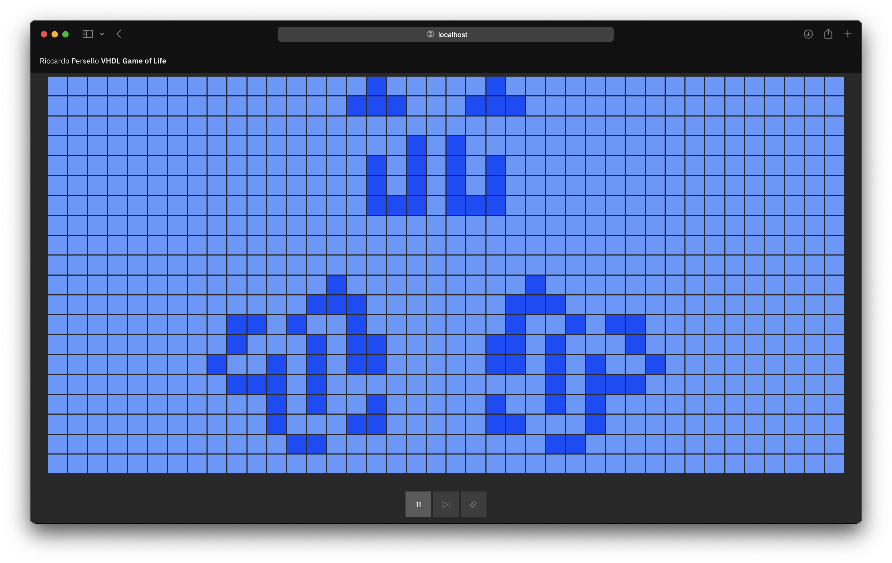

# Containerised VHDL implementation of Conway's Game of Life

_Project for Embedded Systems course_



Arguments:

- VHDL
  - Multiple entities
  - Unit test testbenches
  - Interactive testbench
- Object oriented programming
  - Python (backend API and tests)
  - TypeScript
  - Code generation
- UNIX shell
  - Interaction with a process through piped stdin and stdout
  - Makefile
  - Dockerfiles with shell commands
- DevOps
  - Containerisation
  - Unit tests
  - Git

## How to use

Start an instance of the entire system by using Docker Compose:

```sh
docker-compose up
```

It might take a few minutes to start the system.

Once both the containers are started, navigate to [`localhost`](http://localhost) in your browser.

> The backend might be really slow to start on Apple Silicon machines due to an additional emulation layer, making the frontend unresponsive for a while. The backend (GHDL) container is x86-only.

The interactive documentation for the REST API is available at [`localhost:8000/redoc`](http://localhost:8000/redoc).
